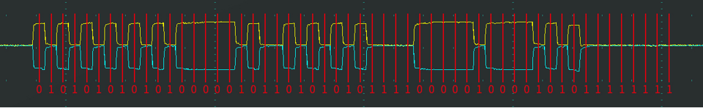
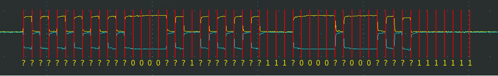
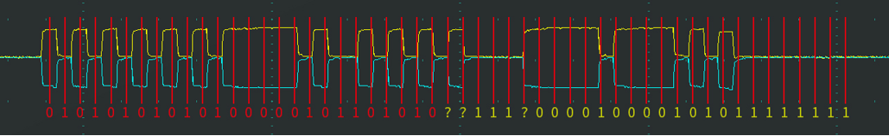
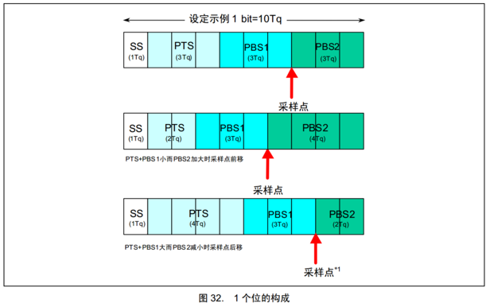
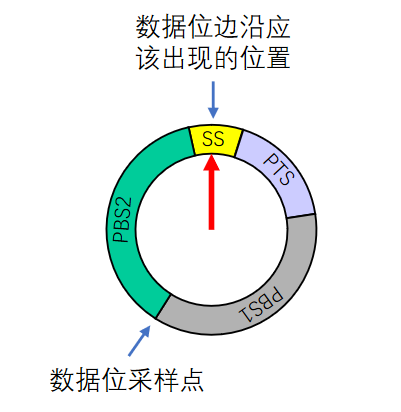
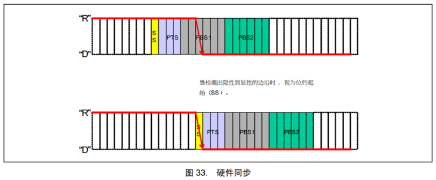
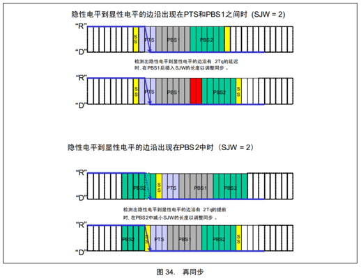

# 一、接收方数据采样

## 1. 简介接收方数据采样

* CAN总线没有时钟线，总线上的所有设备通过**约定波特率**的方式确定每一个数据位的时长
* **发送方**以约定的位时长每隔固定时间输出一个数据位，传输的时候不能停顿
* **接收方**以约定的位时长每隔固定时间采样总线的电平，输入一个数据位
* **理想状态**下，接收方能依次采样到发送方发出的每个数据位，且**采样点位于数据位中心**附近

## 2. 数据采样遇到的问题

###### 2.1 接收方以约定的位时长进行采样，但是采样点没有对齐数据位中心附近

* 就像这个图，如果正好在跳变沿进行采样，采样到的数据一定是错的，解决这个问题，核心就是要以第一个跳变沿为参考，延时半个数据位左右的时间再进行采样，后续再按照固定的采样间隔进行采样，这样的话采样点就位于数据位中心了
* **硬同步**的核心思想就是以第一个跳变沿为参考对齐第一次的数据采样点

###### 2.2 接收方刚开始采样正确，但是随着时钟的误差累计，采样点逐渐偏离

* 就像这个图，一开始采样点是位于中心的，但是由于硬件或者始终的物理原因导致的误差（两个芯片不可能是完全一样的），会导致后面的采样点慢慢偏离中心位置，CAN总线数据位非常多，上百次的数据位可能误差就已经无法接受了
* 解决这个问题，芯片应该能够监视每个跳变沿和采样点的间隔，如果跳变沿和采样点距离太远了，就应该缩短下一次的采样间隔，这样后面所有的采样点都会往前提一提，如果太近了就延长一下下一次的采样间隔，后面的所有采样点就能往后推一推
* **再同步**的核心思想就是以正常数据位的跳变沿为参考，察觉到采样点偏离的趋势了就动态调整采样间隔

# 二、位时序

* 为了灵活调整每个采样点的位置，使采样点对齐数据位中心附近，CAN总线对每一个数据位的时长进行了更细的划分，分为四个段，每个段又由若干个 `最小时间单位（Tq）`构成，这个 `Tq` 可以直接在程序中指定：
  * **同步段（SS）：**固定为 1Tq
  * **传播时间段（PTS）:**自己配置 1~8Tq
  * **相位缓冲段1（PBS1）:**自己配置 1~8Tq
  * **相位缓冲段2（PBS2）:**自己配置 2~8Tq

* SS同步段：如果每次波形跳变沿都在SS同步段，那说明当前设备的位时序和波形是同步的，即我在当前设备定义的位时序，也就是一位的时间正好与波形一位的时间重合，如果跳变沿不在SS同步段，那就需要调整位时序使跳变沿出现在SS段了
* PTS传播时间段：是为了吸收网络上的物理延迟（发送单元的输出延迟、总线上面信号的传播延迟、接收单元的输入延迟的和的两倍）
* PBS1、PBS2相位缓冲段：是为了调整采样点的位置，采样点的位置位于他两中间
* 可以通过调整PTS、PBS1、PBS2他们三个段灵活的调整采样点的位置

# 三、硬同步

1. 就像下图，每个设备都有一个位时序计时周期，当某个设备（发送方）率先发送报文，其他所有设备（接收方）收到**SOF的下降沿（这里是逻辑的下降沿，是CAN总线的张开沿）**时，接收方会将自己的**位时序计时周期拨到SS段**的位置，与发送方的位时序计时周期保持同步

2. **硬同步只在帧的第一个下降沿（SOF下降沿）**有效，因为他是用于对准位时序计时器的初始位置“对表”

3. 经过硬同步后，若发送方和接收方的时钟没有误差，则后续所有数据位的采样点必然都会对齐数据位中心附近，但是是不可能有完全一样的硬件的，必然会有累计误差，所以需要再同步

# 四、再同步

1. 若发送方或接收方的时钟有误差，随着误差积累，数据位边沿逐渐偏离SS段，则此时接收方根据**`再同步补偿宽度值（SJW）`通过`加长PBS1段`，或`缩短PBS2段`，以调整同步**

2. 再同步可以发生在第一个**下降沿（逻辑下降沿，是总线张开沿）之后的`每个数据位跳变边沿`**

* 如上图第一种情况：跳变沿在SS之后说明接收方的时钟跑快了，发送方还在SS的时候，接收方都跑到后面的PTS了，所以要进行误差补偿：
  * 在**PBS1段后之后加SJW补偿2Tq**，这样的话下一次接收的SS段就会往后挪，可以让下一次的跳变沿在SS段内

* 如上图第二情况：跳变沿在SS之前，说明接收方的时钟跑慢了，发送方已经到了SS了，接收方还在上一次数据位的PBS2段，所以要进行误差补偿：
  * 接收方**把自己的PBS2段减少SJW补偿2Tq**，这样的话下一次接收的SS段就会往前挪，可以让下一次的跳变沿在SS段

3. 再同步本质就是以普通的数据跳变沿动态调整位时序，加长或者缩短数据位的时长

**[注] `SJW`是`再同步补偿宽度值`的最大值，范围可以指定为`1~4Tq`**

* **具体补偿多少和误差大小和SJW的大小共同决定**的，如果误差1就补偿1，误差4就补偿4，但是如果误差1是不会补偿4的，**超过最大值只补偿最大值**

* 这个**最大限制是为了防止电平抖动、噪声干扰**，比如在原本一位的时间内，电平上下抖动了一下，如果不加以限制的话再同步会以为这是两位数据，会进行非常激进的补偿，这样会导致整个数据都出错了，所以要对SJW加一限制，因为再同步本身就是用来补偿时钟的微小误差
* 如果设备质量很好时钟误差很小可以把SJW设置为1~2，设备质量不好就设置为3~4，具体情况具体分析

# 五、波特率计算

* 波特率是（码元/秒）比特率是（位/秒，单位是bps），但是在二进制调制下一个码元就是一位，所以波特率=比特率

* 波特率 = 1秒/一个数据位的时长（SS+PTS+PBS1+PBS2）
  * 比如现有设置：SS=1Tq、PTS=3Tq、PBS1=3Tq、PBS2=3Tq
  * 然后1Tq设置为0.5us
  * 那么 **波特率** = 1S/(0.5us + 1.5us + 1.5us + 1.5us) = 1000000us/5us = 200000bps =200kbps
  * 所以这个配置配置出来的CAN波特率就是200Kbps

