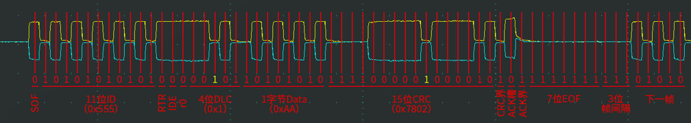

# 一、五种错误类型

1. **位错误：**本质上就是回读机制，想发的位和回读的位不一样就是位错误
   * 仲裁段和应答位排除在外，不参与位错误
   * 接受单元基本上只有应答和输出错误的时候才会检测位错误
2. **填充错误：**
   * CRC后面的CRC界定符ACK槽ACK界定符和EOF帧结束标志是是固定格式，是没有位填充的
3. **CRC错误：**
   * 接收方对比接收到的CRC和自己计算出来的CRC是否相同
4. **格式错误：**
   * 接收方用于判断格式是否合规
5. **ACK错误：**
   * 发送单元在ACK槽检测是否收到响应，发出隐性1收到显性0说明接收方已经发出了应答

# 二、错误状态

1. **所有设备默认处于主动错误状态，如果某个设备报告的错误太多了，说明这个错误不太可靠，转为被动错误状态可以接收状态但是不能发送主动错误标志破坏数据，即便检测到错误也只能发送被动错误标志，如果在被动错误状态下还是一直报告错误，那就转为总线关闭状态，不允许此设备接收数据**
2. 主动错误状态的设备正常参与通信并在检测到错误时发出主动错误帧
3. 被动错误状态的设备正常参与通信但检测到错误时只能发出被动错误帧
4. 总线关闭状态的设备不能参与通信
5. **每个设备内部管理一个TEC**和**REC**，根据**TEC**和**REC**的值确定自己的状态

# 三、错误计数器

# 四、ACK错误波形图示例

1. **设备处于主动错误状态，发送标准数据帧，正常传输**
   * 可以看出来如果是正常的ACK响应显性0，那么ACK界定符+7位EOF+3位帧间隔正好是11位隐性1，符合总线空闲

2. **设备处于主动错误状态，发送标准数据帧，检测到ACK错误**
   * 可以看出来如果没有收到ACK响应显性0，那么发送8位错误界定符+3位帧间隔正好是11位隐性1，符合总线空闲

3. **设备处于被动错误状态，发送标准数据帧，检测到ACK错误**
   * 发送方发送16次主动错误状态后，每一次TEC都+8,16次就是128，TEC>127会进入被动错误状态，在被动错误状态下发送的是被动错误标志(6个隐性1的被动错误标志+8位错误界定符)
   * 从此图可以看出来如果在此时有个主动错误状态的设备和这个处于被动错误状态的设备都想发送数据的话，主动错误状态的设备会直接取得总线控制权，不会和他进行仲裁,因为被动错误状态的设备还正在发送8位延迟传送

