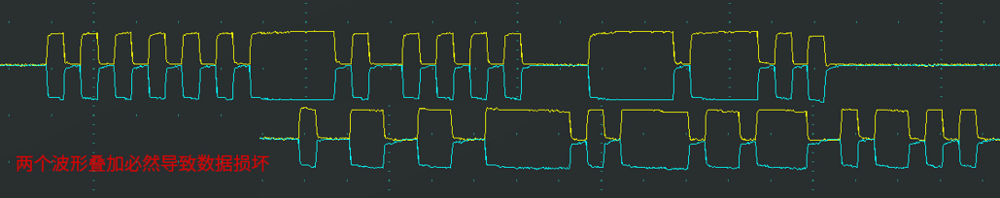
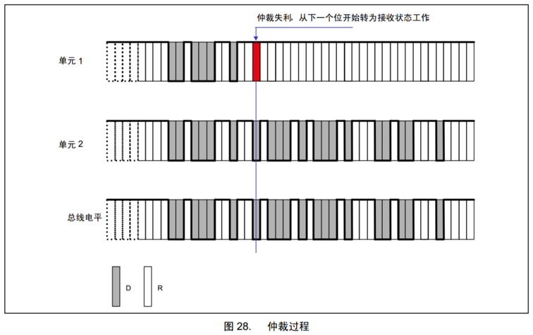
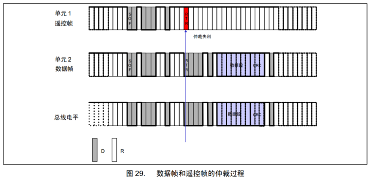
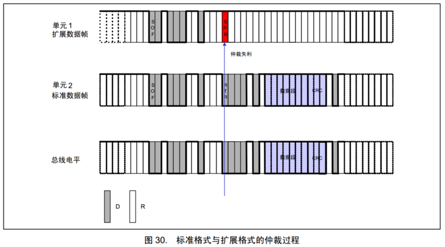

# 一、为什么要进行总线仲裁

> CAN总线只有一对差分信号线，同一时间只能有一个设备操作总线发送数据，若多个设备同时有发送需求，如何分配总线资源就需要制定资源分配规则，依次满足多个设备的发送需求，确保同一时间只有一个设备操作总线

# 二、资源分配规则1-先占先得

1. **若当前已经有设备正在操作总线发送数据帧/遥控帧，则其他任何设备不能再同时发送数据帧/遥控帧（可以发送错误帧/过载帧破坏当前数据）**
2. **任何设备检测到连续11个隐性电平，即认为总线空闲，只有在总线空闲时，设备才能发送数据帧/遥控帧**
3. **一旦有设备正在发送数据帧/遥控帧，总线就会变为活跃状态，必然不会出现连续11个隐性电平，其他设备自然也不会破坏当前发送**
4. **若总线活跃状态其他设备有发送需求，则需要等待总线变为空闲，才能执行发送需求**

# 三、资源分配规则2-非破坏性仲裁

## 1. 简介

1. **若多个设备的发送需求同时到来或因等待而同时到来，则CAN总线协议会根据ID号（仲裁段）进行非破坏性仲裁，ID号小的（优先级高）取到总线控制权，ID号大的（优先级低）仲裁失利后将转入接收状态，等待下一次总线空闲时再尝试发送**

2. **实现非破坏性仲裁需要两个要求：**
   * **线与特性：**总线上任何一个设备发送显性电平0时，总线就会呈现显性电平0状态，只有当所有设备都发送隐性电平1时，总线才呈现隐性电平1状态，即：0 & X & X = 0，1 & 1 & 1 = 1
   * **回读机制：**每个设备发出一个数据位后，都会读回总线当前的电平状态，以确认自己发出的电平是否被真实地发送出去了，根据线与特性，发出0读回必然是0，发出1读回不一定是1，如果发出了1回读是0就说明当前有优先级更高的ID号正在发送，那就停止本机发送，转为接收

## 2. 仲裁过程

* 数据位从前到后依次比较，出现差异且数据位为1的设备仲裁失利，比如下图单元1发送了数据位1释放总线但是回读为0，说明有优先级更高的设备正在发送，单元1就会停止发送转为接收

## 3. 数据帧和遥控帧的优先级

* 数据帧和遥控帧ID号一样时，数据帧的优先级高于遥控帧
* 因为RTR定义为 隐性1是遥控帧，显性0是数据帧，所以哪怕ID一摸一样，遥控帧的优先级也是比数据帧低的

## 4. 标准格式和扩展格式的优先级

* 标准格式11位ID号和扩展格式29位ID号的高11位一样时，标准格式的优先级高于扩展格式
* 因为扩展格式的SRR规定为隐性1，标准格式的此位是RTR规定为显性0，扩展格式会仲裁失败
* 如果标准遥控帧和扩展数据帧相遇的时候也是同理，标准遥控帧会胜出，仲裁成功

